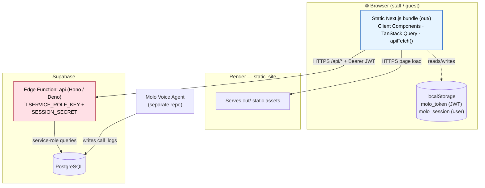
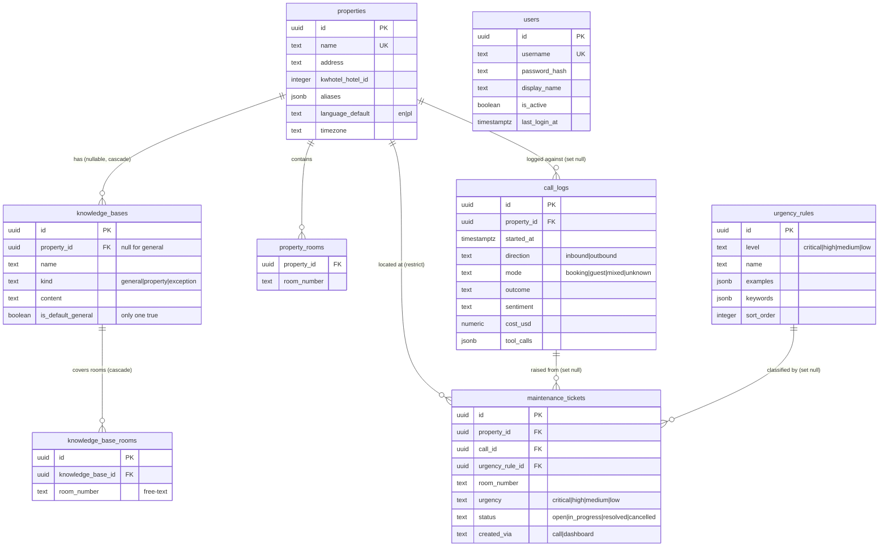
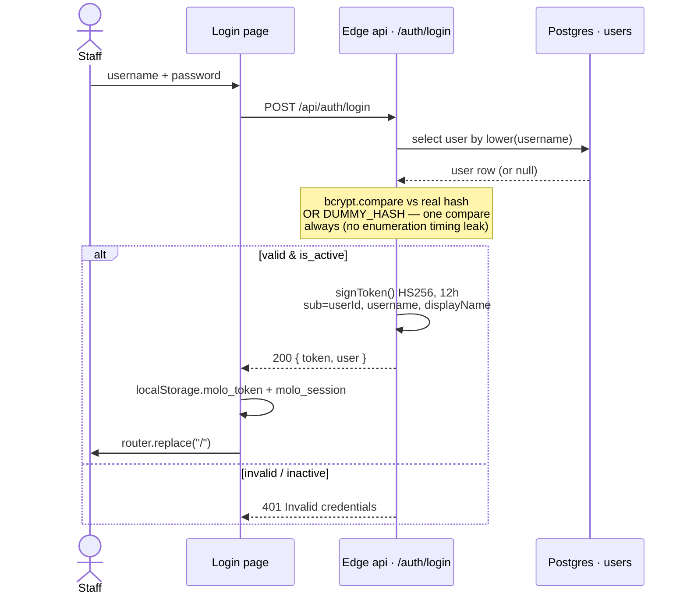
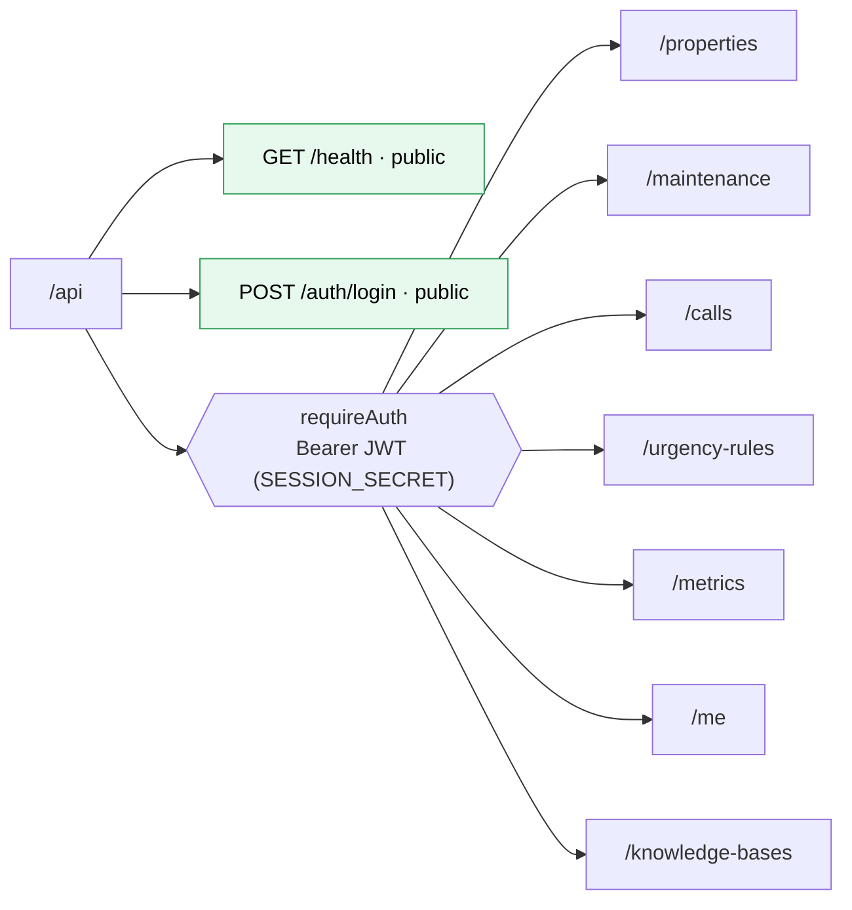
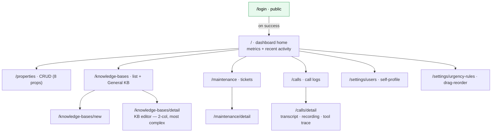
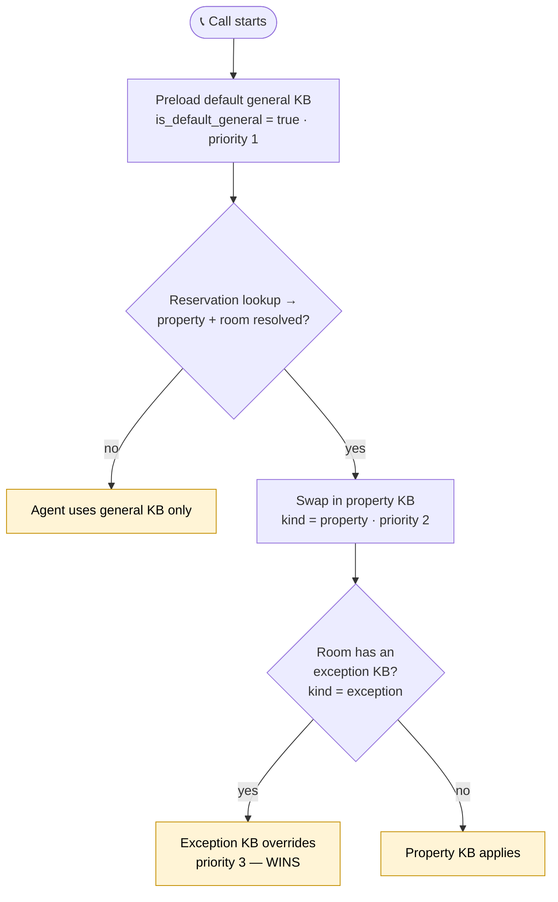
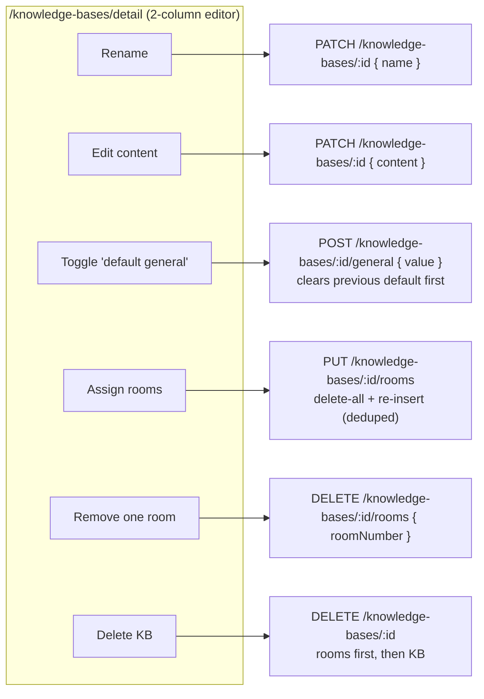
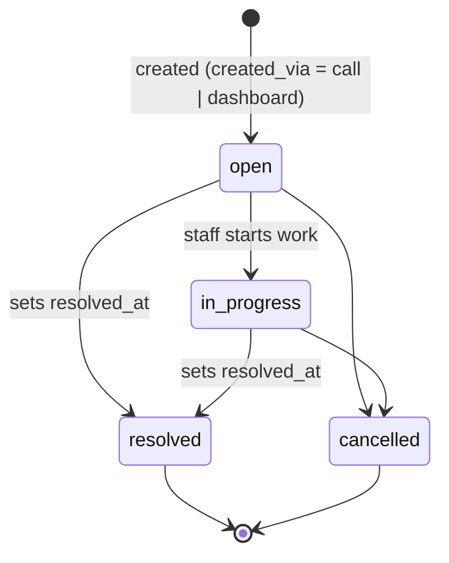

# Molo Voice Agent Dashboard — Architecture Diagrams

All diagrams in Mermaid. Grounded in the actual code (`supabase/functions/api`, `src/lib`, and the schema in `MOLO_PLAN.md §10`).

> Note: the edge auth middleware reads the `SESSION_SECRET` env var (see `middleware/auth.ts` and `lib/jwt.ts`), even though `CLAUDE.md` labels it `JWT_SECRET`. Diagrams below use the code's real name.

---

## 1. Deployment & trust boundary



The single trust line: the browser (blue) holds **no** secret; the edge function (red) alone holds the service-role key and signs/verifies JWTs.

---

## 2. Entity–Relationship diagram (schema the dashboard surfaces)



> `booking_links` and `agent_settings` exist in the SQL schema but were **cut from the dashboard** during the static migration, so they are omitted here.

---

## 3. Login sequence (auth issuance)



---

## 4. Authenticated request lifecycle (every other call)

```mermaid
sequenceDiagram
    participant Q as TanStack Query hook
    participant F as apiFetch()
    participant CORS as CORS middleware
    participant Auth as requireAuth
    participant R as Route handler
    participant SB as serviceClient()
    participant DB as Postgres

    Q->>F: read/mutate
    F->>F: getToken() ← localStorage.molo_token
    F->>CORS: /api/... + Authorization: Bearer JWT
    Note over CORS: allow localhost:3000,<br/>ALLOWED_ORIGINS, *.onrender.com
    CORS->>Auth: origin ok
    Auth->>Auth: verifyToken(JWT, SESSION_SECRET)
    alt token valid
        Auth->>R: c.set("user", claims); next()
        R->>SB: query (service role)
        SB->>DB: SQL
        DB-->>R: rows
        R-->>Q: 200 JSON
    else missing / expired / bad
        Auth-->>F: 401 Unauthorized
        F->>F: clearToken() +<br/>dispatch "molo:unauthorized"
        Note over F: auth-context logout()<br/>→ router.replace("/login")
    end
```

---

## 5. Edge API route map (public vs. JWT-protected)



---

## 6. Frontend route / navigation map



---

## 7. Knowledge-base priority resolution (`kb_for_room`)



The `kb_for_room` view returns every applicable KB for a `(property, room)` pair with `priority = exception(3) > property(2) > general(1)`; app code orders by priority DESC to pick the winner.

---

## 8. KB editor operations → endpoints (the most complex page)



---

## 9. Maintenance ticket state machine (`status` enum)


